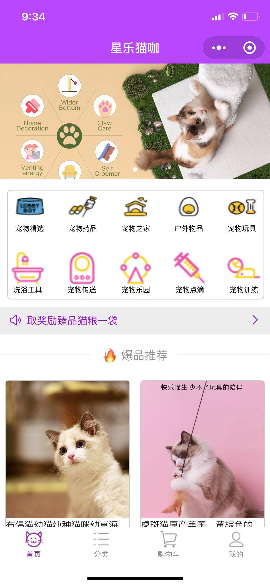
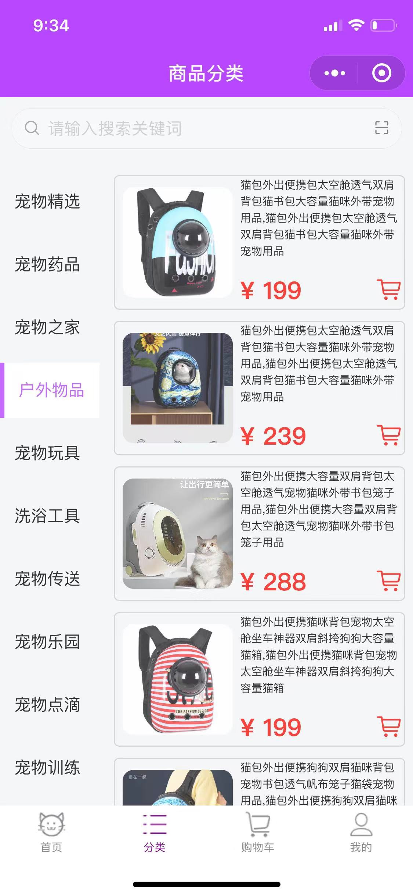
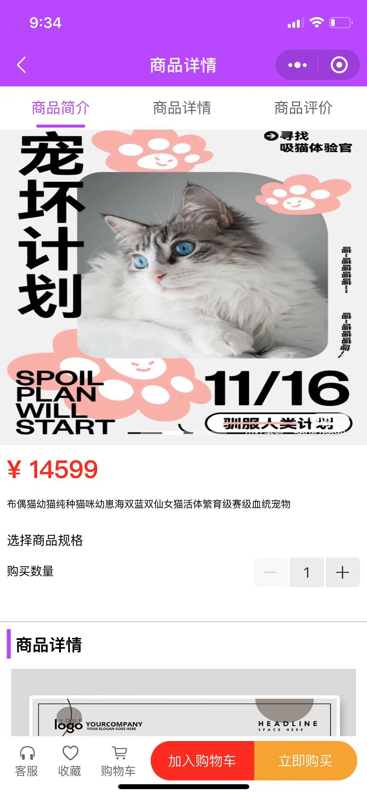
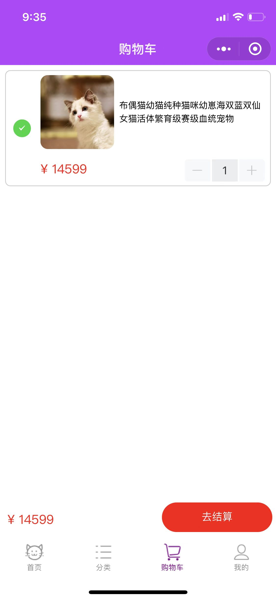
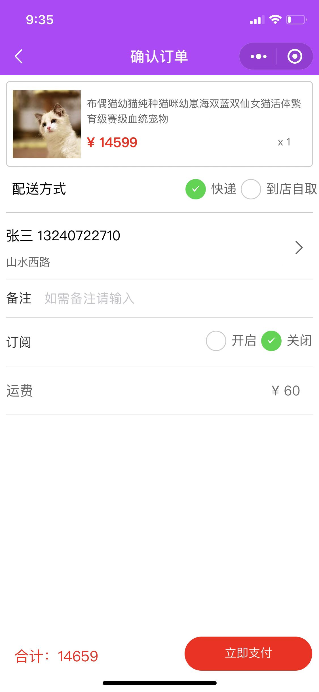
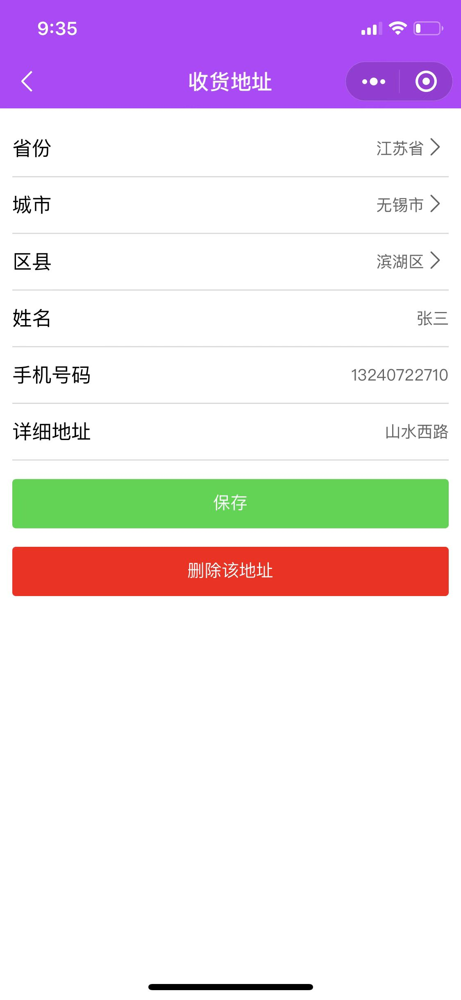
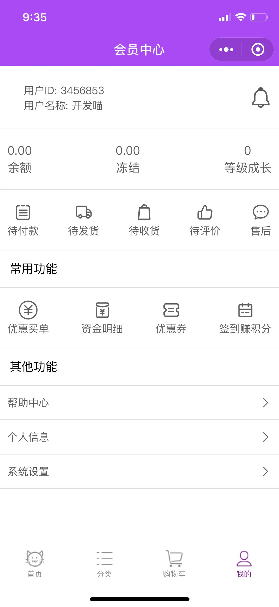

# 基于Vue开发的（星乐猫咖）微信小程序
------------------------

 

## 前言
该项目为前后端分离项目的前端部分（前端的中后台项目）。

## 项目介绍
星乐猫咖（微信小程序）为星乐俱乐部的用户端项目，它主要可以使用户在网络上进行宠物交易，辅助线下店铺进行买卖，可以加减少下店铺的人力资源浪费，加强店铺销售能力。
## 项目演示（已停用）
项目在线演示地址：https://jxlscript.gitee.io/vue-admin-jxl/
## 技术栈
html(5) + css(3) + Javascrip + Vue + vuex + uni-app + ES6/7/8 + axios + uview UI + scss + mock
## 说明
>  本项目主要用于熟悉如何用 uni-app 架构一个微信小程序项目

>  如果对您有帮助，您可以点右上角 "Star" 支持一下 谢谢！ ^_^

>  或者您可以 "follow" 一下，我会不断开源更多的有趣的项目

>  开发环境 MacBook Pro  微信者开发工具 

>  如有问题请直接在 Issues 中提，或者您发现问题并有非常好的解决方案，欢迎 PR 👍

>当你学到这里的时候，恭喜你可以熟练运用Javascript这门语言了，希望在以后的生活里，更加热爱，更加努力。 ^_^

## 项目结构
------------------------

```bash
├── /uniCloud/            # 项目服务器
├── /.hbuilderx/          # 项目编辑器依赖忽略文件
├── /components/          # uni-app组件目录
├── /node_modules/        # 项目框架文件
├── /pages/               # 项目组件文件
├── /static/              # 组件静态资源
├── /statics/             # 非组件静态资源(图片)
├── /store/               # Vuex管理文件
├── /uni_modules/         # uni-app框架文件
├── /unpackage/           # uni-app框架配置文件
├── /util/                # 工具包文件
├── /wxcomponents/        # uview ui组件文件
├── /App.vue/             # 应用配置文件
├── /index.html/          # 项目入口文件
├── /main.js/             # Vue初始化入口文件
├── /manifest.json/       # 配置应用名称，版本等打包信息
├── /package-lock.js/     # 下载信息记录文件       
├── .pages.josn           # 项目页面配置文件
├── .uni-scss             # 全局配置样式变量文件
├── package.json          # 项目依赖
└── README.md             # 项目文档
```
## 完成功能
- [x] 页面首次加载 -- 完成
- [x] 路由拦截 -- 完成
- [x] 全局路由守卫 -- 完成
- [x] 商品选择 -- 完成
- [x] 商品加入购物车 -- 完成
- [x] 商品生成订单 -- 完成
- [x] 用户收货/编辑地址 -- 完成
- [x] 商品模拟支付 -- 完成
- [x] 修改用户信息 -- 完成
## 部分项目截图
首页


商品分类


商品详情


购物车


确认订单


收货地址


会员中心

## 运行项目（项目已上线）以下内容启动项目无效
------------------------

``` bash
# install dependencies
npm install

# serve with hot reload at localhost:8080
npm run serve

# build for production with minification
npm run build

# build for production and view the bundle analyzer report
npm run build --report

# run unit tests
npm run unit

# run e2e tests
npm run e2e

# run all tests
npm test


```
## 技术交流和分享
邮箱：2603020259@qq.com


